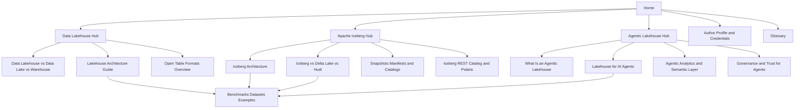
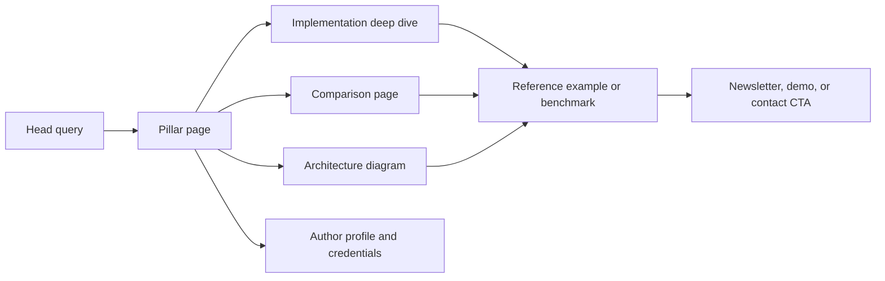

# Search Authority Plan for Data Lakehouse, Apache Iceberg, and Agentic Lakehouse

## Executive Summary

The search opportunity is real, but it is not one opportunity. The live SERPs split into three very different battles: **“data lakehouse”** is a mature, crowded definitional SERP dominated by large vendors and first-mover explainers; **“Apache Iceberg”** is a mixed SERP where the official Apache project is strongest, but vendor explainers and ecosystem pages still win broad informational clicks; **“Agentic Lakehouse”** is still an immature, highly branded SERP with thin neutral coverage, emerging Google architecture content, and only a small amount of academic work. That combination creates the clearest whitespace: a **neutral, standards-first, technically rigorous resource** that explains concepts with citations, diagrams, runnable examples, and explicit tradeoffs. citeturn17search0turn20view0turn20view2turn18search0turn25search1turn19search1turn4view5turn4view6turn19academia19turn19academia22

Your fastest path to authority is **not** publishing dozens of shallow blog posts. It is building a small number of cornerstone pages that do three things current ranking pages often do only partially: define the concept clearly, map the underlying architecture precisely, and connect that explanation to implementation choices across real engines, formats, and governance patterns. The foundational topics are already visible in the Apache Iceberg documentation and specification: schema evolution, partition evolution, snapshots, manifests, optimistic concurrency, hidden partitioning, branching/tagging, engine integrations, and REST Catalogs. Those should become your content system, not just isolated posts. citeturn22view0turn8view0turn26search2turn26search14

The most defensible editorial position is: **open standards + first-hand technical interpretation + original artifacts**. The lakehouse literature emphasizes open formats, ML support, and competitive performance; Iceberg’s official materials emphasize metadata-driven table management, serializable isolation, schema and partition evolution, and manifest/snapshot planning; agentic-lakehouse research and architecture materials emphasize governed access, trustworthy execution, context, and multicloud open data foundations. A site that ties those threads together better than vendor glossaries can earn authority faster than a site that simply rewrites definitions. citeturn6view0turn4view0turn8view0turn4view5turn4view6turn19academia19turn19academia22

The practical recommendation is a **90-day, hub-and-spoke build** centered on six high-authority pages, supported by comparison content, implementation guides, glossary coverage, author pages, and benchmark or reference assets. Pair that with Google-aligned technical hygiene: crawlable internal links, strong title links, canonical control, XML sitemaps, JSON-LD on the pages that merit it, high-quality visible text, and good Core Web Vitals. Google explicitly recommends helpful, reliable, people-first content; crawlable links with descriptive anchor text; XML sitemaps; JSON-LD structured data; and a strong overall page experience, while warning against spammy link practices and scaled low-value AI content. citeturn15search2turn16search3turn9search21turn23search3turn15search8turn16search0turn15search9

## Search Landscape

The current SERP pattern suggests a simple strategic rule:

| Topic | Current SERP state | What wins today | What is missing |
|---|---|---|---|
| Data lakehouse | Mature, vendor-glossary heavy | Short-to-mid-depth definitions, architecture diagrams, broad comparisons | Neutral, deeply sourced explainers with standards-level detail, original comparison matrices, and implementation tradeoffs |
| Apache Iceberg | Mixed official + ecosystem | Apache project, ecosystem/vendor explainers, broad benefit pages | Better “how it works” explainers, metadata diagrams, engine-specific examples, and clearer comparisons versus Delta/Hudi |
| Agentic Lakehouse | Early and volatile | Branded platform pages, architecture announcements, a few glossary pages and papers | Neutral definitions, standards-first architecture, governance/safety detail, and real implementation walkthroughs |

That reading is supported by the live SERPs and primary/official materials: lakehouse content is still mostly conceptual; Iceberg content is feature-rich but often fragmented between docs and vendor explainers; agentic-lakehouse content is still being defined by a small set of product pages, cloud architecture docs, and recent papers. citeturn17search0turn20view0turn20view2turn18search0turn25search1turn25search7turn19search1turn4view5turn4view6turn19academia19turn19academia22

### Data lakehouse competitor summary

**Note:** the live SERP also surfaces discussion and video results, which signals unresolved educational intent. The table below focuses on the visible ranking set that most directly shapes editorial competition, plus two SERP features that matter strategically. Weaknesses and openings are analytical inferences from the cited pages.

| Observed result | Strengths | Weaknesses and openings |
|---|---|---|
| Databricks — *What is a Data Lakehouse?* citeturn17search0turn4view1 | First-mover definitional page; concise explanation; references enabling papers | Vendor-framed; limited neutral comparison across open table formats and catalogs |
| Google Cloud — *What is a Data Lakehouse?* citeturn17search1turn20view0 | Clear three-layer architecture framing | Broad, not especially deep on table-format internals or operational tradeoffs |
| Microsoft Learn — *What is a data lakehouse?* citeturn17search2turn20view1 | Good “what is it used for” framing; clean architecture positioning | Tied to Azure Databricks; thin as a standards-neutral explainer |
| AWS — *What is a Data Lakehouse?* citeturn17search4turn20view2 | Strong “lake vs warehouse vs lakehouse” structure and feature list | Still glossary-style; limited technical depth on metadata layers and open standards |
| Oracle — *What Is a Data Lakehouse?* citeturn17search5turn20view3 | Connects lakehouse to open formats like Iceberg, Delta Lake, and Hudi | Product-adjacent; heavy on grand narrative, lighter on implementation specifics |
| Salesforce — *What Is a Data Lakehouse?* citeturn17search6 | Simple business-language explanation | High-level and non-technical; easy to outrank on expert depth |
| HPE — *Data Lakehouse Glossary* citeturn1search5turn2search13 | Strong benefit-oriented framing around governance and AI | Long but generic; little standards-level precision |
| Fivetran — *Data lakehouse: Architecture, examples, and benefits* citeturn2search22 | Freshness and examples angle | Likely mid-funnel vendor content rather than definitive conceptual source |
| YouTube explainer result citeturn17search7 | Indicates meaningful video intent for the query | Opportunity to embed diagrams/video summaries in your own page and capture multimodal demand |
| Reddit discussion result citeturn17search3 | Reveals query confusion and desire for plain-language answers | Opportunity for a “common misconceptions” section and FAQ-style editorial content |

### Apache Iceberg competitor summary

The strongest Iceberg pages either come directly from Apache or explain the format in relation to lakehouse operations, not just definitions. That means your content must go beyond “what is Iceberg?” and explain *how Iceberg works internally*. citeturn18search0turn4view0turn8view0turn26search14

| Observed result | Strengths | Weaknesses and openings |
|---|---|---|
| Apache Iceberg official site citeturn18search0turn4view0turn22view0 | Highest trust; authoritative feature language; docs navigation maps subtopics clearly | Homepage is not the best pedagogical deep dive for newcomers |
| Apache Iceberg GitHub repo citeturn18search1 | Open-source credibility, implementation proof, release visibility | Not optimized as an explainer for broad search users |
| AWS — *What is Apache Iceberg?* citeturn25search1turn4view2 | Strong benefit framing and service tie-ins | Heavy AWS commercial angle; shallow on manifests/snapshots/catalog design |
| Expedia Group Tech — *A Short Introduction to Apache Iceberg* citeturn25search2 | Clear practitioner explanation; explains why Hive-style folder semantics were limiting | Older page; likely not updated to current spec/features |
| Oracle — *What Is Apache Iceberg?* citeturn25search3turn20view4 | Broad, readable, covers time travel and metadata separation | More benefits than implementation detail; not a diagrams-first architecture page |
| Snowflake — *What Are Apache Iceberg Tables?* citeturn25search4 | Strong enterprise relevance and ecosystem legitimacy | Vendor lens; typically less useful for neutral comparison unless the reader is already tool-evaluating |
| Qlik — *Apache Iceberg: The Basics* citeturn25search6 | Good introductory bridge from lakehouse to Iceberg | Still broad; can be beaten on internals and examples |
| Google Cloud — *What is Apache Iceberg?* citeturn25search7turn4view3 | Fresh page, readable definition, clear “intelligent layer” framing | Lighter on spec mechanics and cross-engine caveats |
| Databricks docs — *What is Apache Iceberg in Databricks?* citeturn26search20 | Good short-form explanation of capabilities and positioning versus Delta | Product-context constrained; not a canonical neutral explainer |
| Monte Carlo — *What Is Apache Iceberg?* citeturn2search23 | Strong ops-observability angle and accessible language | Another broad explainer; likely weaker on raw source citations and format internals |

### Agentic Lakehouse competitor summary

This is the least mature SERP and therefore the highest-upside editorial opportunity. The ranking set is heavily branded, and the clearest non-branded authority signals currently come from Google’s architecture content and a small set of recent academic papers. citeturn19search1turn4view5turn4view6turn19academia19turn19academia22

| Observed result | Strengths | Weaknesses and openings |
|---|---|---|
| Dremio platform page citeturn19search1turn4view4 | Clear branded positioning around MCP, semantic layer, governed metadata, natural-language analytics | Product page more than independent definition; limited neutral framing |
| Dremio home page messaging citeturn19search6turn4view8 | Strong proof points, case studies, concise category language | Homepage is broad; not the best resource for conceptual depth |
| Dremio — *Introducing Dremio Cloud, The Agentic Lakehouse* citeturn21search0 | Product launch clarity; high recency | Campaign-style content; transient shelf life |
| Dremio — *What Is Agentic Analytics* citeturn21search3 | Good adjacent-intent bridge from analytics to architecture | Still category-defining from a vendor perspective |
| DataLakehouseHub glossary entry citeturn19search0turn20view5 | Direct definitional intent match | Thin, highly Dremio-dependent, and not visibly source-rich |
| Google Cloud blog — *The future of data lakehouse for the agentic era* citeturn3search1turn4view5 | Fresh cloud-provider signal; connects context, agents, and Iceberg-based lakehouse foundations | Announcement tone; less neutral and less implementation-detailed than a true guide |
| Google Architecture Center — *Build a multicloud open data lakehouse* citeturn3search4turn4view6 | The strongest architecture-first source in the SERP; concrete multicloud/governance framing | Use-case specific; still cloud-provider scoped |
| Databricks session page — *The Agentic Lakehouse: Optiver's AI Data Stack* citeturn19search4turn3search3 | Signals ecosystem demand and real user journeys | Event page, not canonical educational content |
| NetApp — *An agentic lakehouse from NetApp and Dremio* citeturn19search9turn19search7 | Partner validation and on-prem/object-storage angle | Solution-brief style; weak as a neutral definition page |
| Academic papers on trustworthy/safe agentic lakehouse workflows citeturn19academia19turn19academia22 | Strongest neutral/technical foundation around trust, isolation, governance, and safe execution | Academic density leaves room for a practical translator page with diagrams and examples |

**Bottom line:** to outrank or coexist with this set, your pages should be more source-rich than vendor glossaries, more readable than papers/specs, and more implementation-aware than generic explainers. citeturn6view0turn8view0turn19academia19turn19academia22

## Content Architecture

The site should be organized around three hub pages, then drilled down by comparisons, internals, tutorials, and trust/governance content. Apache Iceberg’s official information architecture is especially useful here because it already names the concepts advanced users actually care about: schemas, partitioning, evolution, maintenance, performance, reliability, branch/tag workflows, integrations, and REST Catalogs. citeturn22view0turn22view3



### Prioritized new pages and posts

The first six items below are the highest-priority launch set. They align to the strongest head terms, the clearest subtopic demand from official docs, and the biggest authority gaps in the current SERP.

| Priority | Title | Recommended slug | Primary target keywords | Intent | Suggested length | Internal linking targets |
|---|---|---|---|---|---:|---|
| Highest | What Is a Data Lakehouse | `/data-lakehouse/` | data lakehouse, what is a data lakehouse | Informational head term | 2,500–3,500 words | `/apache-iceberg/`, `/data-lakehouse-vs-data-lake-vs-data-warehouse/`, `/agentic-lakehouse/` |
| Highest | Apache Iceberg Explained | `/apache-iceberg/` | Apache Iceberg, what is Apache Iceberg, Iceberg tables | Informational head term | 3,000–4,000 words | `/apache-iceberg-architecture/`, `/apache-iceberg-vs-delta-lake-vs-hudi/`, `/data-lakehouse/` |
| Highest | What Is an Agentic Lakehouse | `/agentic-lakehouse/` | agentic lakehouse, what is an agentic lakehouse | Category-definition | 2,500–3,500 words | `/lakehouse-for-ai-agents/`, `/agentic-analytics/`, `/data-lakehouse/` |
| Highest | Apache Iceberg Architecture | `/apache-iceberg-architecture/` | Apache Iceberg architecture, Iceberg snapshots, Iceberg manifests, Iceberg catalog | Deep informational | 3,000–4,500 words | `/apache-iceberg/`, `/apache-iceberg-snapshots-and-time-travel/`, `/apache-iceberg-rest-catalog/` |
| Highest | Apache Iceberg vs Delta Lake vs Apache Hudi | `/apache-iceberg-vs-delta-lake-vs-hudi/` | Iceberg vs Delta Lake vs Hudi, open table formats comparison | Comparative commercial and technical | 3,500–5,000 words | `/apache-iceberg/`, `/open-table-formats/`, `/data-lakehouse/` |
| Highest | Data Lakehouse vs Data Lake vs Data Warehouse | `/data-lakehouse-vs-data-lake-vs-data-warehouse/` | data lakehouse vs data lake vs data warehouse | Comparison | 2,000–3,000 words | `/data-lakehouse/`, `/open-table-formats/` |
| High | Open Table Formats Explained | `/open-table-formats/` | open table formats, data lake table formats | Informational comparison | 2,500–3,500 words | `/apache-iceberg/`, `/apache-iceberg-vs-delta-lake-vs-hudi/` |
| High | Apache Iceberg Snapshots, Time Travel, and Rollbacks | `/apache-iceberg-snapshots-and-time-travel/` | Iceberg snapshots, Iceberg time travel | Deep informational | 2,000–3,000 words | `/apache-iceberg/`, `/apache-iceberg-architecture/` |
| High | Apache Iceberg Schema Evolution and Hidden Partitioning | `/apache-iceberg-schema-evolution/` | Iceberg schema evolution, hidden partitioning | Deep informational | 2,000–3,000 words | `/apache-iceberg/`, `/apache-iceberg-architecture/` |
| High | Iceberg REST Catalogs, Apache Polaris, and Interoperability | `/apache-iceberg-rest-catalog/` | Iceberg REST catalog, Iceberg catalog, Apache Polaris | Mid-tail technical | 2,500–3,500 words | `/apache-iceberg/`, `/lakehouse-for-ai-agents/` |
| High | Lakehouse for AI Agents | `/lakehouse-for-ai-agents/` | lakehouse for AI agents, AI agents on enterprise data, agentic lakehouse architecture | Emerging informational | 2,500–4,000 words | `/agentic-lakehouse/`, `/agentic-analytics/`, `/data-lakehouse/` |
| High | Agentic Analytics and the Semantic Layer | `/agentic-analytics/` | agentic analytics, semantic layer for AI agents | Emerging category | 2,000–3,000 words | `/agentic-lakehouse/`, `/lakehouse-for-ai-agents/` |
| Medium | Benchmarking Open Table Formats | `/benchmarks/open-table-formats/` | Iceberg performance, Delta vs Hudi vs Iceberg performance | Research and linkable asset | 2,500–4,000 words | `/apache-iceberg-vs-delta-lake-vs-hudi/`, `/open-table-formats/` |
| Medium | Common Misconceptions About Data Lakehouse and Iceberg | `/blog/data-lakehouse-and-iceberg-misconceptions/` | data lakehouse misconceptions, Iceberg misconceptions | Informational and CTR support | 1,500–2,200 words | All three hubs |
| Medium | Build a Multicloud Open Lakehouse for Agents | `/blog/multicloud-agentic-lakehouse-reference-architecture/` | multicloud open lakehouse, agentic lakehouse architecture | Advanced thought leadership | 1,800–3,000 words | `/agentic-lakehouse/`, `/lakehouse-for-ai-agents/` |

### Keyword clusters and long-tail targets

These clusters are inferred from live SERP patterns, Apache Iceberg’s docs/spec information architecture, and the terminology used across lakehouse and agentic-lakehouse papers and vendor docs. citeturn22view0turn8view0turn6view0turn4view5turn4view6turn19academia19turn19academia22

| Cluster | Pillar page | Representative long-tail queries to target |
|---|---|---|
| Data lakehouse fundamentals | `/data-lakehouse/` | what is a data lakehouse; how does a data lakehouse work; data lakehouse architecture; benefits of a data lakehouse; lakehouse for AI |
| Core comparisons | `/data-lakehouse-vs-data-lake-vs-data-warehouse/` | data lakehouse vs data warehouse; data lakehouse vs data lake; when to choose a lakehouse; lakehouse vs warehouse for BI and ML |
| Apache Iceberg fundamentals | `/apache-iceberg/` | what is Apache Iceberg; what are Iceberg tables; why use Apache Iceberg; Apache Iceberg use cases |
| Apache Iceberg internals | `/apache-iceberg-architecture/` | Iceberg snapshots explained; Iceberg manifest list; how Iceberg catalogs work; Iceberg optimistic concurrency; Iceberg schema evolution |
| Open table formats | `/apache-iceberg-vs-delta-lake-vs-hudi/` | Iceberg vs Delta Lake vs Hudi; best open table format; Iceberg vs Delta Lake for lakehouse; Hudi vs Iceberg for streaming |
| Catalogs and interoperability | `/apache-iceberg-rest-catalog/` | Iceberg REST catalog; Apache Polaris vs other catalogs; multi-engine Iceberg catalog; Iceberg interoperability |
| Agentic lakehouse | `/agentic-lakehouse/` | what is an agentic lakehouse; agentic lakehouse architecture; governed data for AI agents; trusted AI agents and lakehouse |
| Agentic analytics | `/agentic-analytics/` | what is agentic analytics; semantic layer for AI agents; AI agents querying enterprise data; lakehouse for natural-language analytics |

### Recommended editorial flow



## Top Page Outlines

The six outlines below are designed to beat the current ranking set by combining definitional clarity, official-source citation density, and visual explanation.

### What Is a Data Lakehouse

**Slug:** `/data-lakehouse/`  
**Search role:** primary definitional pillar

| Element | Recommendation |
|---|---|
| Core headings | What a data lakehouse is; why the architecture emerged; how a lakehouse works; the storage, metadata, and semantic layers; lakehouse vs data lake vs warehouse; the role of open table formats; when a lakehouse is the right fit; common misconceptions; FAQs |
| Key points to cover | Use the lakehouse paper to frame the original architectural motivation around open formats, ML support, performance, reducing staleness, improving reliability, reducing TCO, and avoiding lock-in; then explain how vendor pages converge on object storage + metadata + access/semantic layers. citeturn6view0turn20view0turn20view2turn20view3 |
| Visuals | One canonical three-layer lakehouse diagram; one “lake vs warehouse vs lakehouse” comparison table; one timeline from warehouse → lake → lakehouse |
| Schema types | `TechArticle`, `Article`, `BreadcrumbList` citeturn12search0turn23search4turn14search0 |

### Apache Iceberg Explained

**Slug:** `/apache-iceberg/`  
**Search role:** primary head-term page

| Element | Recommendation |
|---|---|
| Core headings | What Apache Iceberg is; why Iceberg was created; the core abstraction; key capabilities; snapshots, manifests, metadata files, and catalogs; engine support; where Iceberg fits in a lakehouse; when not to use Iceberg |
| Key points to cover | Quote the official description in paraphrase: Iceberg is a high-performance format for huge analytic tables; explain file-level metadata tracking, schema and partition evolution, optimistic/serializable isolation, and multi-engine access using the specification and feature pages. citeturn4view0turn8view0turn26search2turn26search14 |
| Visuals | “Iceberg stack” illustration from object storage → metadata → catalog → engines; animated or step-by-step write commit flow; comparison table against plain Parquet folders |
| Schema types | `TechArticle`, `Article`, `BreadcrumbList` citeturn12search0turn23search4turn14search0 |

### What Is an Agentic Lakehouse

**Slug:** `/agentic-lakehouse/`  
**Search role:** definitional ownership of an emerging category

| Element | Recommendation |
|---|---|
| Core headings | What “agentic lakehouse” means; how it differs from a standard lakehouse; the four required layers; context and semantic meaning; governed execution and trust; multicloud and open standards; risks and misconceptions; examples |
| Key points to cover | Separate the *vendor phrase* from the *architectural pattern*. Use cloud architecture docs and recent papers to define the non-negotiables: governed access, trustworthy execution, contextual metadata, open/multicloud interoperability, and safe action loops for agents. citeturn4view5turn4view6turn19academia19turn19academia22 |
| Visuals | A reference architecture showing agent interface → semantic/context layer → governed query layer → lakehouse/open table formats → source systems; a “chatbot vs agentic analytics vs agentic lakehouse” matrix |
| Schema types | `TechArticle`, `Article`, `BreadcrumbList` |

### Apache Iceberg Architecture

**Slug:** `/apache-iceberg-architecture/`  
**Search role:** deep technical page that earns links from practitioners

| Element | Recommendation |
|---|---|
| Core headings | The metadata tree; table metadata files; snapshots; manifest lists; manifest files; data and delete files; commit flow; query planning; concurrency and retries; retention and garbage collection |
| Key points to cover | Explain the exact official model: snapshots are tracked in table metadata; data files are tracked through manifests; manifest lists summarize manifests; readers operate on committed snapshots; writers commit by atomically swapping metadata pointers and retry when the base version changes. citeturn8view0 |
| Visuals | A layered tree diagram of metadata JSON → snapshot → manifest list → manifests → data and delete files; one sequence diagram of read and write paths |
| Schema types | `TechArticle`, `Article`, `BreadcrumbList` |

### Apache Iceberg vs Delta Lake vs Apache Hudi

**Slug:** `/apache-iceberg-vs-delta-lake-vs-hudi/`  
**Search role:** comparison page with strong commercial and technical value

| Element | Recommendation |
|---|---|
| Core headings | What an open table format is; how each format manages table state; schema evolution; upserts/deletes; engine interoperability; streaming and incremental processing; governance and ecosystems; decision framework by workload |
| Key points to cover | Use official or primary-source language where possible: Iceberg emphasizes metadata-driven snapshots/evolution, Delta Lake uses a transaction-log model over object stores, and Hudi emphasizes efficient upserts, deletes, incremental processing, table services, and ingestion paths. Include one neutral decision matrix by workload. citeturn6view1turn26search0turn26search6turn26search7turn26search1turn26search10turn25academia12turn26search15 |
| Visuals | Feature matrix; write-path comparison diagram; “choose this if…” flowchart |
| Schema types | `TechArticle`, `Article`, `BreadcrumbList` |

### Data Lakehouse vs Data Lake vs Data Warehouse

**Slug:** `/data-lakehouse-vs-data-lake-vs-data-warehouse/`  
**Search role:** comparison page that captures high CTR and supports the pillar

| Element | Recommendation |
|---|---|
| Core headings | The three architectures defined; storage model differences; governance differences; performance and cost tradeoffs; AI and ML implications; decision criteria; migration triggers |
| Key points to cover | Use the strongest parts of AWS, Google, Microsoft, and the lakehouse paper: schema-on-write vs raw/open storage, unified analytics, metadata layers, freshness, and workload breadth. Add clear “choose X when…” guidance. citeturn20view0turn20view1turn20view2turn6view0 |
| Visuals | Decision tree; workload-to-architecture matrix; layered cost/complexity comparison |
| Schema types | `TechArticle`, `Article`, `BreadcrumbList` |

## Technical SEO and Structured Data

### Technical and on-page priorities

| Area | Recommendation | Why it matters |
|---|---|---|
| Crawlability | Make every priority page reachable via HTML `<a href>` links from hubs, related posts, glossary entries, and breadcrumbs; use descriptive anchor text such as “Iceberg snapshots and manifests” instead of “read more.” | Google uses links both for discovery and as a relevancy signal, and recommends descriptive anchor text. citeturn16search3turn9search2 |
| Titles | Use unique, clear titles that match query intent. Example: `Apache Iceberg Explained: Architecture, Snapshots, Manifests, and Catalogs`. | Google recommends unique, clear, concise titles that describe the page. citeturn9search1turn9search13 |
| Meta descriptions | Write specific, query-matched descriptions for every pillar and comparison page; emphasize the unique asset on the page, such as “diagram,” “benchmark,” or “decision matrix.” | Google may use the meta description when it better summarizes the page. citeturn14search8 |
| Canonicals | Canonicalize overlapping glossary, pillar, and blog pages so that “what is X” content does not compete with comparison pages or event pages. | Google groups duplicates and selects canonicals; explicit canonical signals help. citeturn9search23turn9search12 |
| Sitemaps | Maintain XML sitemaps for pages and, if relevant, image/video assets; update immediately when cornerstone pages go live. | Sitemaps help search engines crawl important pages more efficiently. citeturn9search21turn10search7 |
| Robots and index control | Use `noindex` for thin landing pages, tag archives, or duplicate utility pages; do not rely on `robots.txt` to keep indexable pages out of Search. | Google explicitly says robots.txt is not a mechanism for keeping a page out of Google; use `noindex` if needed. citeturn16search10turn10search13 |
| JavaScript SEO | Ensure the primary text, headings, links, and structured data of cornerstone pages are present in rendered HTML and not hidden behind delayed hydration. | Google processes JavaScript in crawl/render/index phases; critical content needs to be accessible. citeturn10search17 |
| Page experience | Target good Core Web Vitals on priority pages: LCP ≤ 2.5s, INP ≤ 200ms, CLS ≤ 0.1; also ensure HTTPS, mobile parity, and no intrusive interstitials. | Google recommends good Core Web Vitals and strong overall page experience. citeturn10search0turn10search5turn15search8turn10search19 |
| Author trust signals | Add robust author pages, credentials, source citations, update dates, and “how this page was researched” blocks for cornerstone pages. | Google’s people-first guidance emphasizes helpful, reliable content, and ProfilePage markup is designed to help explain creators with first-hand perspectives. citeturn15search2turn15search1 |
| AI-assisted production | Use AI for outlining or drafting support only if every page is edited with original interpretation, diagrams, source citation, and practitioner judgment. | Google warns that scaled low-value AI content can violate spam policies; useful AI-assisted work is acceptable when it adds value. citeturn15search9turn16search0 |

### Structured data strategy

Use structured data to improve machine understanding and eligibility for richer search appearances, but do not treat it as a ranking shortcut. Google explicitly says structured data can enable rich results but does not guarantee them. JSON-LD is the recommended format, and the markup must accurately reflect visible content on the page. citeturn23search3turn14search6

| Page type | Recommended schema | Notes |
|---|---|---|
| Homepage | `Organization`, `WebSite` | Helps site identity and site-name understanding. citeturn23search5turn9search4 |
| Pillar guides and comparison pages | `Article` + `TechArticle` + `BreadcrumbList` | Best fit for technical explainers and deep guides. citeturn12search0turn23search4turn14search0 |
| Author pages | `ProfilePage` | Especially useful if the site leans on first-hand practitioner expertise. citeturn15search1turn14search14 |
| Benchmark or downloadable dataset pages | `Dataset` | Valuable if you publish benchmark inputs, reproducible notebooks, or downloadable CSV/Parquet assets. citeturn14search9 |
| FAQ sections | `FAQPage` only as a secondary machine-readable enhancement | Do **not** expect broad Google FAQ rich-result impact; Google now limits FAQ rich results mainly to authoritative government and health sites. citeturn13search0 |

### JSON-LD examples

Use examples like the following as templates. Replace URLs, images, and author/publisher values with your real values, and make sure every marked-up element is visible on the page. citeturn23search3turn14search4

#### Pillar guide

```json
{
  "@context": "https://schema.org",
  "@type": ["TechArticle", "Article"],
  "@id": "https://example.com/apache-iceberg/#article",
  "headline": "Apache Iceberg Explained: Architecture, Snapshots, Manifests, and Catalogs",
  "description": "A technical guide to how Apache Iceberg works, including snapshots, manifest lists, schema evolution, hidden partitioning, and catalog design.",
  "mainEntityOfPage": {
    "@type": "WebPage",
    "@id": "https://example.com/apache-iceberg/"
  },
  "author": {
    "@type": "Person",
    "name": "Example Author",
    "url": "https://example.com/authors/example-author/"
  },
  "publisher": {
    "@type": "Organization",
    "name": "Example Site",
    "logo": {
      "@type": "ImageObject",
      "url": "https://example.com/static/logo.png"
    }
  },
  "datePublished": "2026-05-14",
  "dateModified": "2026-05-14",
  "image": ["https://example.com/static/iceberg-architecture-diagram.png"],
  "about": [
    { "@type": "Thing", "name": "Apache Iceberg" },
    { "@type": "Thing", "name": "Data Lakehouse" },
    { "@type": "Thing", "name": "Open Table Formats" }
  ],
  "keywords": [
    "Apache Iceberg",
    "Iceberg architecture",
    "Iceberg snapshots",
    "Iceberg manifests",
    "Iceberg catalogs"
  ]
}
```

#### Breadcrumbs

```json
{
  "@context": "https://schema.org",
  "@type": "BreadcrumbList",
  "itemListElement": [
    {
      "@type": "ListItem",
      "position": 1,
      "name": "Home",
      "item": "https://example.com/"
    },
    {
      "@type": "ListItem",
      "position": 2,
      "name": "Apache Iceberg",
      "item": "https://example.com/apache-iceberg/"
    },
    {
      "@type": "ListItem",
      "position": 3,
      "name": "Architecture",
      "item": "https://example.com/apache-iceberg-architecture/"
    }
  ]
}
```

#### Dataset page for benchmarks or downloadable examples

```json
{
  "@context": "https://schema.org",
  "@type": "Dataset",
  "@id": "https://example.com/benchmarks/open-table-formats/#dataset",
  "name": "Open Table Formats Benchmark Dataset",
  "description": "Benchmark inputs and result tables used to compare Apache Iceberg, Delta Lake, and Apache Hudi for analytics workloads.",
  "url": "https://example.com/benchmarks/open-table-formats/",
  "creator": {
    "@type": "Organization",
    "name": "Example Site"
  },
  "license": "https://creativecommons.org/licenses/by/4.0/",
  "distribution": [
    {
      "@type": "DataDownload",
      "encodingFormat": "application/zip",
      "contentUrl": "https://example.com/downloads/open-table-formats-benchmark.zip"
    }
  ],
  "keywords": [
    "Apache Iceberg benchmark",
    "Delta Lake benchmark",
    "Apache Hudi benchmark",
    "open table formats"
  ]
}
```

## Authority and Outreach

The safest and most durable link strategy is to earn citations by publishing things the current SERP leaders often do not offer: **neutral synthesis, original diagrams, reproducible code, benchmark assets, and standards-level explainers**. Google recommends getting your site linked to by other sites but explicitly warns against paying for links, and its spam policies punish manipulative practices. citeturn16search1turn16search0

### Outreach motions that match this topic space

| Motion | What to create | Target sites or communities | Anchor text suggestions |
|---|---|---|---|
| Standards explainer outreach | Canonical diagram-rich explainers on Iceberg internals and open table formats | Apache Iceberg community/talks/vendors ecosystem, vendor education teams whose pages already rank, and practitioner publications in the current SERP ecosystem such as Expedia Group Tech, Qlik, Fivetran, Google Cloud, AWS, Oracle, Snowflake, and Databricks-related docs/blog surfaces. citeturn22view0turn25search2turn25search6turn2search22turn25search7turn25search1turn25search3turn25search4turn26search20 | “Apache Iceberg architecture”, “open table formats explained”, “Iceberg snapshots and manifests” |
| Original benchmark asset | Publish a benchmark methodology page + dataset + repo + changelog | Open table format comparison pages, cloud/vendor ecosystem teams, and peers covering Iceberg/Delta/Hudi tradeoffs. Official comparison-related pages already exist in AWS and academic literature, which gives this asset natural citation value if rigorous. citeturn26search15turn25academia12turn25academia13 | “Iceberg vs Delta Lake vs Hudi benchmark”, “open table format performance comparison” |
| Agentic architecture thought leadership | Publish one neutral “agentic lakehouse reference architecture” page tied to trust, governance, and multicloud design | Google Cloud architecture/community surfaces, partner solution ecosystems, and outlets looking for practical translations of emerging category language | “agentic lakehouse architecture”, “governed data for AI agents”, “multicloud open lakehouse for agents” |
| First-hand perspective | Publish author pages, talk slides, mini case writeups, and code notebooks tied to real implementation lessons | Communities and search features that reward first-hand perspective; ProfilePage markup helps formalize that author signal. citeturn15search1 | “practitioner guide to Apache Iceberg”, “lessons from building lakehouse architectures” |

### Outreach sequence

Use a repeatable cadence rather than one-off campaigns:

1. Publish the pillar or benchmark asset with diagrams, code, and citations.
2. Create one derivative format: short deck, diagram-only summary, repository README, and a short post pointing back to the canonical page.
3. Contact sites already publishing the topic and offer either a contribution, correction, source addition, or a benchmark/data point that improves their page.
4. Track links and mentions at the **page level**, not just the domain level.
5. Refresh the asset every time the spec, docs, or ecosystem meaningfully changes.

### Link rules to follow

Avoid paid links, bulk guest-post networks, low-value directory submission, or anchor-text stuffing. If your site includes user-generated links in comments or forums, qualify them correctly; Google recommends `rel="ugc"` for user-generated content. citeturn16search1turn16search0turn16search5

## Measurement and Timeline

Use **Search Console + Analytics + a simple dashboard** as the operating system for this plan. Google recommends using Search Console together with Analytics for a fuller SEO picture, and the Search results performance reports expose the core metrics you need: clicks, impressions, CTR, and average position. citeturn16search9turn24search0turn24search1

### KPIs

| KPI | Why it matters | How to track |
|---|---|---|
| Non-branded clicks and impressions by topic cluster | Shows whether authority is growing beyond your own brand | Search Console query filters and regex groups for lakehouse, Iceberg, and agentic terms. citeturn24search8turn24search2 |
| Average position for priority pages | Indicates whether pages are entering realistic ranking range | Search Console page-level and query-level reports. citeturn24search0turn24search1 |
| CTR on head-term and comparison pages | Measures whether titles/snippets are competitive | Search Console page + query views; inspect low-CTR, high-impression pages first. citeturn24search8 |
| Indexed status of all cornerstone pages | Prevents publishing into a crawl/indexing hole | Search Console URL Inspection + sitemap monitoring; use `site:` as a rough external check. citeturn15search5turn10search8 |
| Core Web Vitals pass rate on priority URLs | Supports page experience competitiveness | Search Console CWV + page-level field data and Lighthouse/RUM. citeturn10search0turn10search8turn10search19 |
| Rich-result validity | Ensures structured data is usable | Rich Results Test + Search Console enhancement reports. citeturn14search15turn23search3 |
| Referring domains to pillar pages | Proxy for authority growth | Preferred backlink index/tool; review monthly |
| Assisted business outcomes | Makes SEO accountable to site goals | Analytics events for newsletter signup, demo request, repo stars, asset downloads, or contact submissions |

### Timeline

| Window | Deliverables | Success criteria |
|---|---|---|
| First 30 days | Publish the three hub pages and two core comparison pages; create author profile page; deploy sitemap/canonical/JSON-LD baseline | All launch pages indexable, in sitemap, interlinked, and technically clean |
| Days 30 to 60 | Publish Iceberg architecture deep dive + first benchmark/reference asset; begin outreach to ranking ecosystems | Priority pages indexed; first non-branded impressions appear; first external mentions/links land |
| Days 60 to 90 | Publish agentic-lakehouse support pages and tutorials; refresh titles/descriptions from CTR data; add visual assets | 6–10 pages consistently earning impressions; several pages entering top 20 on long-tail queries |
| Months 4 to 6 | Expand spokes; refresh pages using new spec/cloud/ecosystem changes; create second linkable asset | Head and mid-tail queries show measurable CTR and ranking lift; backlinks accrue to pillars rather than just blog posts |
| Months 6 to 12 | Consolidate winners; prune underperformers; update cornerstone pages quarterly | Ownership of niche long-tail clusters and visible authority on agentic-lakehouse terms |

### Dashboard design

Create one dashboard with these views:

- **Topic cluster view:** lakehouse, Iceberg, agentic-lakehouse, open table formats.
- **Page cohort view:** the six cornerstone pages only.
- **CTR diagnostics view:** high-impression pages sorted by lowest CTR.
- **Indexing and markup health view:** indexed pages, enhancement validity, CWV pass rate.
- **Authority view:** new referring domains and page-level links.

## Open Questions and Limitations

This plan is based on current public English-language SERPs, official docs, and primary-source papers, but it is **not** a full site audit. I did not have your actual URL inventory, information architecture, internal-link graph, backlink profile, log files, or page-speed traces. That means the strategy is high-confidence at the market/topic level, but some implementation priorities could change once your current site is crawled page by page.

I also did **not** use third-party keyword-volume tools, so the keyword clusters are based on live SERP evidence, docs information architecture, and category terminology rather than estimated monthly search volume. For this topic set, that is a reasonable tradeoff because “Agentic Lakehouse” is still a rapidly evolving, meaning-contested SERP, while “Apache Iceberg” and “data lakehouse” already reveal strong subtopic demand through the pages that rank. citeturn19search1turn4view5turn4view6turn22view0turn17search0turn18search0
