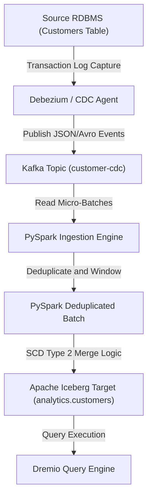

In modern analytical systems, capturing and preserving historical changes in data is a critical requirement. Organizations need to understand not only the current state of their business entities but also how those entities evolved over time. Traditionally, relational databases and proprietary data warehouses were the primary platforms for tracking these changes. However, with the rise of open data lakehouses, data engineers are now tasked with implementing these historical data patterns on top of cloud object storage.

Two fundamental techniques for managing historical data in analytical repositories are Change Data Capture (CDC) and Slowly Changing Dimensions (SCD), particularly Slowly Changing Dimension Type 2 (SCD Type 2). Change Data Capture represents the process of identifying and capturing changes made to a source database and delivering those changes to a downstream target. Slowly Changing Dimension Type 2 is a modeling technique where historical records are preserved by creating new rows for each change, using start dates, end dates, and active flags to denote validity periods.

Implementing CDC and SCD Type 2 on top of object storage was historically difficult because of the limitations of legacy file formats like Parquet, ORC, or JSON. Without transactional guarantees, concurrency controls, or row-level mutability, updating a data lake table meant overwriting large collections of files. This introduced significant operational overhead, risked data corruption, and limited the frequency of data updates.

Apache Iceberg addresses these challenges by bringing transaction guarantees, metadata management, and row-level operations to the open lakehouse. By decoupled metadata from physical storage, Iceberg allows data engines to perform ACID transactions, run snapshot isolation queries, and manage historical table versions without modifying downstream readers.

This comprehensive guide details the design patterns, architectural considerations, and implementation steps for building robust CDC and SCD Type 2 pipelines on Apache Iceberg. We will look at deduplication strategies, PySpark and Spark SQL merge patterns, time travel analysis, and how high-performance engines like the Dremio engine optimize query execution over these historical table structures.

---

## 1. Changing Dimension Patterns and CDC Pipelines in Open Lakehouses

To build a reliable historical pipeline, we must first define the core patterns and the architecture that moves data from relational database management systems (RDBMS) to the open lakehouse. Change Data Capture and Slowly Changing Dimensions operate at different stages of the data integration lifecycle, but they work together to ensure that no state transitions are lost.

### The Role of CDC Ingestion

Change Data Capture pipelines capture row-level modifications (inserts, updates, and deletes) from source systems in real time or near-real time. A typical CDC architecture relies on a log-based capture mechanism, such as Debezium, which monitors the transaction logs of databases like PostgreSQL, MySQL, or Oracle.

Once a change is detected, the CDC engine publishes the event to a message broker like Apache Kafka or Apache Pulsar. These events contain both the old state of the row and the new state, along with metadata such as the change type (Insert, Update, Delete) and a source database transaction timestamp.

The events are then ingested from the broker by a stream processing framework or micro-batch engine, such as Apache Spark Structured Streaming, Apache Flink, or a custom PySpark execution job. The ingestion process writes these change events into a landing table or raw storage zone in the lakehouse. This raw zone, often called the bronze layer, acts as an append-only log of all changes captured from the source systems.

### Slowly Changing Dimension Type 2 (SCD Type 2) Mechanics

While the landing zone stores a flat history of changes, analytical users need a clean, structured representation of this history. This is where Slowly Changing Dimension Type 2 is applied.

SCD Type 2 tracks historical updates by creating a new record for every change. Unlike SCD Type 1, which simply overwrites existing values, SCD Type 2 retains the old values and appends the new values as a separate row. To manage these historical rows, the table schema is enriched with specific tracking columns:

- **Business Key / Natural Key**: The identifier that links the records back to the source system entity (such as `customer_id` or `order_id`).
- **Surrogate Key**: A unique identifier generated within the lakehouse to identify each version of a record.
- **Effective Start Timestamp**: The time when the record version became valid.
- **Effective End Timestamp**: The time when the record version ceased to be valid. If the record is active, this value is set to a distant future date (such as `9999-12-31 23:59:59`) or left as null.
- **Is Current Flag**: A boolean indicator (true or false) or a status string indicating whether the record version represents the active state of the entity.

By storing data in this format, users can easily query the current state of any customer or order by filtering for rows where `is_current` is true. At the same time, users can query the state of any entity at a specific point in time by writing filter clauses that match the validity window: `target_timestamp BETWEEN effective_start_timestamp AND effective_end_timestamp`.

### Architectural Challenges in the Lakehouse

Building SCD Type 2 tables in a data lake house introduces unique challenges compared to relational databases.

In a traditional database, updates and inserts are processed using index lookups and row-level locks. In a cloud data lakehouse, physical data is stored in immutable Parquet files. To apply an update, the processing engine must read the existing files, identify the affected rows, modify their metadata or data content, and write new files.

This process can lead to the small files problem. If CDC updates are applied too frequently, the table becomes cluttered with small Parquet files, leading to high metadata overhead and slow read performance. Additionally, handling concurrent transactions (such as concurrent write jobs and query engines accessing the table) requires strong isolation levels to prevent dirty reads or lost updates.

Apache Iceberg solves these issues by using snapshot-based metadata. When Spark or another engine writes data, it creates a new snapshot that points to the new files while retaining pointers to the old files. Readers continue to query the older snapshot until the write transaction commits. This design enables concurrent reads and writes, snapshot isolation, and efficient file pruning, making Iceberg the ideal format for CDC and SCD Type 2 pipelines.

---

## 2. Ingestion Pipelines with Change Data Capture

Before applying change logs to our target SCD Type 2 dimension tables, we must capture and land the source change stream. We will define our core schemas based on the canonical entities: `analytics.orders` and `analytics.customers`.

For our examples, we will model the source changes representing customer data. Let us examine the structures of the source data and target tables.

### Source Schema and Target Schema Definitions

The source changes are captured from a relational table mapped to `analytics.customers`. The source schema contains the following fields:

- `customer_id` (Integer): The primary key of the customer record.
- `name` (String): The name of the customer.
- `email` (String): The email address of the customer.
- `state` (String): The geographical state where the customer resides.
- `signup_date` (Date): The date the customer registered.

In our CDC stream, every event includes metadata fields indicating the operation type and order of operations:

- `op_type` (String): The operation type, where 'I' is insert, 'U' is update, and 'D' is delete.
- `source_ts` (Timestamp): The timestamp when the operation occurred in the source database. This timestamp is critical for ordering events.

The historical target table, which we will maintain in Apache Iceberg, requires additional metadata fields to track the SCD Type 2 states:

- `customer_id` (Integer): The customer identifier.
- `name` (String): The customer's name.
- `email` (String): The customer's email.
- `state` (String): The customer's state.
- `signup_date` (Date): The registration date.
- `effective_start` (Timestamp): The start timestamp of the record version.
- `effective_end` (Timestamp): The end timestamp of the record version.
- `is_current` (Boolean): A flag indicating if the row is the active version.

### Handling Late-Arriving Records and Source Ordering

One of the most complex aspects of building a CDC pipeline is handling out-of-order data and late-arriving records. Network latencies, retry mechanisms, and distributed queuing systems can cause CDC events to arrive out of order.

For example, an update event for `customer_id = 100` might arrive before the insert event for the same customer. If the pipeline processes events strictly in the order they are received, it could overwrite a newer state with an older state, leading to data corruption.

To prevent this, the pipeline must implement an ordering mechanism based on a source-provided sequence number or timestamp (`source_ts`). Before writing a batch of updates to the Iceberg table, the ingestion engine must deduplicate the batch, retaining only the latest event for each business key.

If multiple updates for the same business key exist within a single micro-batch, we must perform windowing logic to select the record with the maximum `source_ts`. This ensures that only the latest state is merged into the historical table, while previous states are either discarded or written as intermediate historical records.

### CDC Ingestion Pipeline Flow

Let us look at the visual representation of how CDC event streams flow from source databases to the target Apache Iceberg tables:



This architecture ensures that source database modifications are captured immediately, staged in a broker, cleaned of duplicates, and merged transactionally into the target Iceberg dataset.

---

## 3. Implementing CDC Pipelines with PySpark

Now that we understand the ingestion architecture, we will build a PySpark execution script that reads CDC events, deduplicates them, and prepares them for the SCD Type 2 merge process.

### PySpark Environment Setup

To build the pipeline, we must configure a Spark Session with the Apache Iceberg dependencies. The following code configures a local spark environment to write to an Iceberg REST catalog.

```python
from pyspark.sql import SparkSession
from pyspark.sql.functions import col, row_number, desc
from pyspark.sql.window import Window

/* Configure PySpark with the Apache Iceberg runtime jar and REST catalog */
spark = SparkSession.builder \
    .appName("IcebergCDCPipeline") \
    .config("spark.jars.packages", "org.apache.iceberg:iceberg-spark-runtime-3.5_2.12:1.5.0") \
    .config("spark.sql.extensions", "org.apache.iceberg.spark.extensions.IcebergSparkSessionExtensions") \
    .config("spark.sql.catalog.rest_catalog", "org.apache.iceberg.spark.SparkCatalog") \
    .config("spark.sql.catalog.rest_catalog.type", "rest") \
    .config("spark.sql.catalog.rest_catalog.uri", "http://localhost:8181") \
    .config("spark.sql.catalog.rest_catalog.warehouse", "s3a://lakehouse-warehouse/") \
    .getOrCreate()
```

### Deduplication Logic for Micro-Batches

Before merging new CDC data into the target Iceberg table, we must handle scenarios where a single micro-batch contains multiple records for the same customer.

The following python function receives a raw DataFrame of incoming CDC events, defines a window partitioned by `customer_id` and ordered by the source timestamp `source_ts` descending, and extracts only the latest change event for each customer.

```python
def deduplicate_cdc_batch(raw_df):
    /*
    Deduplicate the incoming CDC DataFrame using window functions.
    This selects the latest state based on the source transaction timestamp.
    */
    window_spec = Window.partitionBy("customer_id").orderBy(desc("source_ts"))

    deduplicated_df = raw_df \
        .withColumn("row_num", row_number().over(window_spec)) \
        .filter(col("row_num") == 1) \
        .drop("row_num")

    return deduplicated_df
```

Let us write a test script that simulates a raw micro-batch of customer events containing updates, inserts, and duplicate entries. We will execute the deduplication function and display the results.

```python
# Simulate raw CDC records, including duplicate keys for customer 1
raw_cdc_data = [
    (1, "Alice Smith", "alice.smith@example.com", "CA", "2026-01-10", "I", "2026-05-22 10:00:00"),
    (1, "Alice Jones", "alice.jones@example.com", "NY", "2026-01-10", "U", "2026-05-22 10:05:00"),
    (2, "Bob Miller", "bob.miller@example.com", "TX", "2026-02-15", "I", "2026-05-22 10:01:00"),
    (3, "Charlie Davis", "charlie@example.com", "FL", "2026-03-20", "I", "2026-05-22 10:02:00"),
    (2, "Bob Miller", "bob.m@example.com", "TX", "2026-02-15", "U", "2026-05-22 10:08:00")
]

# Define schema for the incoming CDC stream
cdc_columns = ["customer_id", "name", "email", "state", "signup_date", "op_type", "source_ts"]

# Create DataFrame
raw_cdc_df = spark.createDataFrame(raw_cdc_data, schema=cdc_columns)

# Cast source_ts to timestamp
raw_cdc_df = raw_cdc_df.withColumn("source_ts", col("source_ts").cast("timestamp"))

# Deduplicate batch
cleaned_cdc_df = deduplicate_cdc_batch(raw_cdc_df)
cleaned_cdc_df.show()
```

The output of the deduplication script shows that the multiple records for Alice (customer 1) and Bob (customer 2) are resolved, leaving only the records corresponding to the latest timestamp.

---

## 4. Merging CDC Streams using Spark SQL

Once the batch is deduplicated, we must merge it into the target Apache Iceberg SCD Type 2 table. This operation requires updating active rows that have changed (end-dating them) and inserting new rows (both for new entities and for the new versions of updated entities).

We can achieve this using the Spark SQL `MERGE INTO` statement. Let us examine the logic and compare how Copy-on-Write and Merge-on-Read table modes handle this operation.

### Initializing the Target Table

First, we must create the target Iceberg table if it does not exist. We will include the SCD Type 2 columns in the definition.

```sql
CREATE TABLE IF NOT EXISTS rest_catalog.analytics.customers (
    customer_id INT,
    name STRING,
    email STRING,
    state STRING,
    signup_date DATE,
    effective_start TIMESTAMP,
    effective_end TIMESTAMP,
    is_current BOOLEAN
)
USING iceberg
TBLPROPERTIES (
    'write.format.default' = 'parquet',
    'write.merge.mode' = 'merge-on-read'
);
```

### The SCD Type 2 Merge Pattern

A standard `MERGE INTO` statement matches incoming records with target rows based on the business key. However, in an SCD Type 2 target, a single business key can have multiple rows representing historical states. We must ensure that we match only against the active row (where `is_current` is true).

Furthermore, when an update occurs, we must perform two actions:

1.  Update the existing active record in the target table by setting `is_current` to false and `effective_end` to the update timestamp.
2.  Insert the new version of the record with `is_current` to true, `effective_start` to the update timestamp, and `effective_end` to the distant future date.

Because standard SQL `MERGE INTO` executes a single action per matched row, we must structure our merge query to output multiple rows for each update. A common pattern is to write a query that joins the target table with the deduplicated changes, generates rows for the updates, and merges that combined set into the target table.

Let us look at the SQL query that executes this SCD Type 2 merge pattern. We will run this query inside our PySpark script.

```python
# Register the deduplicated updates as a temporary view
cleaned_cdc_df.createOrReplaceTempView("deduped_updates")

# Execute the SCD Type 2 merge query
spark.sql("""
MERGE INTO rest_catalog.analytics.customers AS target
USING (
    /*
    This subquery prepares the staging data for the merge.
    It contains:
    - New records (inserts) that do not exist in the target table.
    - Updated records that must be inserted as new active versions.
    - An update marker record to update the end dates of existing active records.
    */
    SELECT
        NULL AS merge_key,
        u.customer_id,
        u.name,
        u.email,
        u.state,
        u.signup_date,
        u.source_ts AS effective_start,
        CAST('9999-12-31 23:59:59' AS TIMESTAMP) AS effective_end,
        true AS is_current
    FROM deduped_updates u

    UNION ALL

    SELECT
        u.customer_id AS merge_key,
        u.customer_id,
        u.name,
        u.email,
        u.state,
        u.signup_date,
        u.source_ts AS effective_start,
        u.source_ts AS effective_end,
        false AS is_current
    FROM deduped_updates u
    JOIN rest_catalog.analytics.customers t
      ON u.customer_id = t.customer_id
     WHERE t.is_current = true
) AS source
ON target.customer_id = source.merge_key
   AND target.is_current = true
WHEN MATCHED THEN
    /* For existing active records matched by the update marker, end-date the record */
    UPDATE SET
        target.effective_end = source.effective_end,
        target.is_current = false
WHEN NOT MATCHED THEN
    /* For new inserts and new active versions of updated records, insert the row */
    INSERT (
        customer_id,
        name,
        email,
        state,
        signup_date,
        effective_start,
        effective_end,
        is_current
    )
    VALUES (
        source.customer_id,
        source.name,
        source.email,
        source.state,
        source.signup_date,
        source.effective_start,
        source.effective_end,
        source.is_current
    );
""")
```

### Analysis of the Merge Query Logic

Let us break down the mechanics of this merge query:

- ** Staging Subquery (`USING` clause)**: The subquery performs a union operation to create a unified change feed. The first branch selects the incoming change records, setting `merge_key` to null. Because `merge_key` is null, these records will never match an existing row in the target table based on the `ON target.customer_id = source.merge_key` clause. This forces the merge engine to execute the `WHEN NOT MATCHED` action, inserting these rows as new active versions.
- **The Second Branch of the Union**: This branch selects the incoming changes that match an active row in the target table. It retains the `customer_id` as the `merge_key`. When joined in the `ON` clause, this `merge_key` matches the existing active target row. This triggers the `WHEN MATCHED` action.
- **Matched Action**: The matched action updates the existing active target row. It sets `is_current` to false and updates `effective_end` to the source transaction timestamp. This effectively retires the old version of the record.
- **Not Matched Action**: The not matched action inserts the new rows. This includes both brand-new customer inserts and the new active versions of existing customers.

This single-pass merge query guarantees transactional safety. Because Apache Iceberg supports atomic multi-file commits, either all modifications (end-dating old rows and writing new rows) succeed, or none do. This avoids partial updates that could leave the SCD Type 2 table in an inconsistent state.

### Copy-on-Write vs. Merge-on-Read Mechanics

Apache Iceberg supports two modes for writing data modifications: Copy-on-Write (CoW) and Merge-on-Read (MoR). The choice of mode significantly impacts merge query performance and file layouts.

In Copy-on-Write mode, any update or delete operation requires the engine to read the existing Parquet data file, apply the modification in memory, and write a new Parquet file containing the modified data. For SCD Type 2 operations, CoW means that updating the `effective_end` date of an old active record forces Spark to rewrite the entire data file containing that row.

This introduces high write latency and write amplification, especially for large tables with low-frequency updates. However, CoW tables are highly optimized for read performance, as there are no extra files to resolve at query time.

In Merge-on-Read mode, update and delete operations do not modify existing data files. Instead, the engine writes the modifications to separate files called delete files. There are two types of delete files:

- **Positional Deletes**: These files store the file path and row position of the deleted or updated rows.
- **Equality Deletes**: These files store the value of the columns (such as `customer_id`) that identify the deleted rows.

When an update is executed in MoR mode, Spark writes the new data rows to a new data file, and writes the positions of the updated target rows to a positional delete file. This eliminates write amplification and speeds up ingestion times.

The tradeoff occurs during read execution. When a query engine reads an MoR table, it must read the data files, read the delete files, and apply the deletes in memory to filter out modified rows. This can degrade read performance if the table is not compacted regularly.

For high-frequency CDC workloads, Merge-on-Read is the recommended configuration. We will explore how query acceleration engines like Dremio mitigate the read penalty of MoR tables in a subsequent section.

---

## 5. Reconstructing Historical Table States

One of the greatest benefits of implementing SCD Type 2 tables in Apache Iceberg is the ability to reconstruct historical states and query data exactly as it existed at any point in time. This is achieved using standard SQL queries, Iceberg's metadata tables, and the native time travel features.

### Querying the Current State

To retrieve the active state of all entities, users can write a straightforward query filtering for rows where `is_current` is true.

```sql
SELECT customer_id, name, email, state, signup_date
  FROM rest_catalog.analytics.customers
 WHERE is_current = true;
```

This query returns the active profile for each customer, corresponding to the latest changes captured from the source database.

### Querying State at a Specific Timestamp (Point-in-Time Queries)

To query the state of a customer or the entire dataset at a historical point in time, we write filters against the `effective_start` and `effective_end` columns. For example, to check the state of customer records as they existed on `2026-05-22 10:03:00`, we run:

```sql
SELECT customer_id, name, email, state
  FROM rest_catalog.analytics.customers
 WHERE CAST('2026-05-22 10:03:00' AS TIMESTAMP)
       BETWEEN effective_start AND effective_end;
```

This query filters out any record versions that were not yet active or had already been end-dated by that timestamp, providing an accurate view of the database state at that precise moment.

### Time Travel via Iceberg Snapshots

In addition to querying the columns of an SCD Type 2 table, we can leverage Apache Iceberg's snapshot history. Every write operation in Iceberg creates a new snapshot. We can perform time travel queries by specifying a snapshot ID or a historical timestamp.

When we use Iceberg time travel, the engine reads the table metadata as it existed at that snapshot, ignoring any files written after that snapshot was created.

To retrieve the history of snapshots for our target table, we query the `snapshots` metadata table:

```sql
SELECT committed_at, snapshot_id, parent_id, operation
  FROM rest_catalog.analytics.customers.snapshots
 ORDER BY committed_at DESC;
```

Once we identify the snapshot ID or timestamp we wish to inspect, we can execute a time travel query using PySpark or Spark SQL.

```python
# PySpark Time Travel by Snapshot ID
snapshot_df = spark.read \
    .option("snapshot-id", 8901234567890123456) \
    .table("rest_catalog.analytics.customers")

# PySpark Time Travel by Timestamp
historical_timestamp = "2026-05-22 10:02:00"
time_travel_df = spark.read \
    .option("as-of-timestamp", int(spark.sql(f"select unix_millis(cast('{historical_timestamp}' as timestamp))").collect()[0][0])) \
    .table("rest_catalog.analytics.customers")
```

We can also write time travel queries directly in Spark SQL:

```sql
/* Query the table as of a specific system timestamp */
SELECT *
  FROM rest_catalog.analytics.customers
       TIMESTAMP AS OF '2026-05-22 10:02:00';

/* Query the table as of a specific snapshot ID */
SELECT *
  FROM rest_catalog.analytics.customers
       VERSION AS OF 8901234567890123456;
```

### Contrast Between SCD Type 2 and Time Travel

It is important to distinguish between SCD Type 2 point-in-time queries and Iceberg metadata time travel:

- **SCD Type 2 Point-in-Time**: This query searches the _business_ history. It answers: "What was the customer's active email in the source system on May 22?" Even if we update the table today, the history remains stored in the rows of the table.
- **Iceberg Metadata Time Travel**: This query searches the _system_ history. It answers: "What did the customer table look like inside our lakehouse before we ran our morning Spark ingestion job?"

If an incorrect merge operation corrupts data, metadata time travel allows us to inspect the pre-merge state and restore the table to the last known good snapshot. SCD Type 2, on the other hand, tracks the logical business transitions.

---

## 6. Query Acceleration with the Dremio Engine

While Spark is excellent for orchestrating heavy ETL merge operations, analytical users and business intelligence tools require fast, sub-second responses when querying these tables. Querying SCD Type 2 tables can be computationally expensive due to the complex date filters, joins, and the presence of delete files in Merge-on-Read tables.

The Dremio engine acts as an acceleration layer that sits directly on top of open table formats like Apache Iceberg, delivering rapid query performance. Let us analyze the mechanisms that the Dremio engine uses to optimize queries over SCD Type 2 and CDC datasets.

### Vectorized Memory Layouts (Apache Arrow)

At the core of the Dremio engine's execution model is Apache Arrow, a columnar, in-memory data representation. When Dremio processes a query, it reads data from Parquet files and loads it directly into Arrow memory buffers.

Because Arrow and Parquet share a columnar structure, Dremio can transfer data from disk to memory with minimal CPU overhead. The vectorized execution model allows Dremio to apply filter conditions (such as `is_current = true` or `target_timestamp BETWEEN effective_start AND effective_end`) across arrays of values simultaneously, leveraging Single Instruction Multiple Data (SIMD) hardware capabilities. This is far faster than row-by-row processing, resulting in significant speedups for complex historical queries.

### Metadata Caching

To plan a query, an engine must first parse the Iceberg metadata tree, starting from the table metadata JSON file, resolving the manifest list, and reading the individual manifest files. If the target catalog or cloud storage repository suffers from network latency, this metadata resolution phase can add seconds to query execution times.

The Dremio engine solves this problem by using a local coordinator metadata cache. The Dremio coordinator node automatically caches Iceberg metadata files locally. When a query is submitted, Dremio reads the manifest trees from its fast local cache instead of making multiple API calls to object storage. This reduces query planning latency to milliseconds.

### Automatic Query Rewrites with Data Reflections

One of Dremio's most powerful acceleration features is Data Reflections. A Reflection is an optimized physical representation of a table's data, stored in Parquet format, that is managed automatically by Dremio.

For SCD Type 2 tables, we can define two types of Reflections:

- **Raw Reflections**: These store a copy of the table sorted or partitioned by columns frequently used in query filters, such as `is_current` or `customer_id`.
- **Aggregation Reflections**: These store pre-computed aggregates and dimensions for reporting queries.

When a user executes a query, the Dremio query optimizer (which uses Apache Calcite) analyzes the query plan. If it finds a matching Reflection, it automatically rewrites the query to read from the Reflection instead of scanning the raw Iceberg table. This translation is completely transparent to the user; the user queries the original table, and Dremio accelerates the query behind the scenes.

For instance, if we build a Raw Reflection partitioned by `is_current`, Dremio can satisfy queries for the active customer profile by reading only the slice of the Reflection where `is_current` is true, avoiding scans of the historical rows.

### Positional and Equality Delete File Caching

As discussed earlier, running `MERGE INTO` updates on Merge-on-Read Iceberg tables produces positional or equality delete files. When reading these tables, engines must merge these delete files with the base data files.

This reconciliation is a major performance bottleneck in open lakehouses. If an engine has to fetch delete files from remote storage and apply them on the fly for every query, read latencies will grow.

The Dremio engine optimizes this process by caching positional and equality delete files in memory. During execution, Dremio loads these delete sets into memory structures. As the vectorized reader scans base Parquet data files, it cross-references the cached delete keys and drops excluded rows on the fly in memory. By avoiding repetitive object storage accesses for delete files, Dremio makes querying Merge-on-Read Iceberg tables nearly as fast as querying Copy-on-Write tables.

---

## 7. Operational Best Practices for Historical Dimensions

To maintain high performance and prevent storage costs from expanding, data engineers must run regular maintenance tasks on historical Iceberg tables. Let us review the primary operations required to manage these datasets.

### Running Compaction

Over time, continuous CDC ingestion will result in the accumulation of many small files and delete files. We must compact these files into larger, optimized Parquet blocks.

We can run compaction procedures in Apache Spark. The `rewrite_data_files` procedure merges small data files and applies active deletes, creating clean consolidated Parquet files.

```sql
/* Run compaction on the customer table to merge small files and apply deletes */
CALL rest_catalog.system.rewrite_data_files(
    table => 'analytics.customers',
    options => map(
        'max-file-group-size-bytes', '536870912', /* 512MB */
        'min-input-files', '5'
    )
);
```

For large tables, we can configure sort-based compaction or Z-Order sorting to place related records close together on disk. This improves file pruning for point-in-time queries.

```sql
/* Compact data files using Z-Order sorting on customer_id and state */
CALL rest_catalog.system.rewrite_data_files(
    table => 'analytics.customers',
    strategy => 'sort',
    sort_order => 'ZORDER(customer_id, state)'
);
```

### Snapshot Expiration and Orphan File Cleanup

Each compaction run and merge operation creates new snapshots, but the old snapshots and files remain in storage to support time travel. If left unchecked, this historical data will increase cloud storage costs.

To manage this, we must configure a snapshot expiration policy. Expiring old snapshots removes the metadata pointers and makes the associated data files eligible for physical deletion.

The following Spark statement expires snapshots older than 14 days, ensuring that we maintain a reasonable history window while controlling costs.

```sql
/* Expire snapshots older than 14 days */
CALL rest_catalog.system.expire_snapshots(
    table => 'analytics.customers',
    older_than => TIMESTAMP AS OF (current_timestamp() - INTERVAL 14 DAYS),
    retain_last => 10
);
```

After expiring snapshots, some physical files may remain in storage if they were not referenced by any metadata files. We clean these up using the `remove_orphan_files` procedure:

```sql
/* Remove orphan files that are no longer tracked by Iceberg metadata */
CALL rest_catalog.system.remove_orphan_files(
    table => 'analytics.customers',
    older_than => TIMESTAMP AS OF (current_timestamp() - INTERVAL 14 DAYS)
);
```

### Metadata File Pruning

In tables with high transaction volumes, the metadata JSON files themselves can become large. We can configure table properties to prune metadata files automatically after every commit.

```sql
ALTER TABLE rest_catalog.analytics.customers SET TBLPROPERTIES (
    'write.metadata.delete-after-commit.enabled' = 'true',
    'write.metadata.previous-versions-max' = '50'
);
```

These settings keep the metadata footprints small, improving query planning performance for both Spark and the Dremio engine.

---

## 8. Verifying a Sample Orders Pipeline

To ensure completeness, we will write a PySpark integration script that applies the same CDC and SCD Type 2 patterns to our other canonical dataset: `analytics.orders`.

### Target Orders Table Structure

The `analytics.orders` table has the following columns:

- `order_id` (Integer): The primary identifier.
- `customer_id` (Integer): The customer who placed the order.
- `order_date` (Date): The date of the order.
- `status` (String): The status of the order (such as 'PENDING', 'SHIPPED', 'DELIVERED').
- `amount` (Double): The financial amount.
- `effective_start` (Timestamp): SCD Type 2 start timestamp.
- `effective_end` (Timestamp): SCD Type 2 end timestamp.
- `is_current` (Boolean): Active status flag.

### Code Implementation for Orders Ingestion

The following script initializes the target orders table, processes a micro-batch of order status updates, and applies the SCD Type 2 merge logic.

```python
# Initialize the target table in PySpark
spark.sql("""
CREATE TABLE IF NOT EXISTS rest_catalog.analytics.orders (
    order_id INT,
    customer_id INT,
    order_date DATE,
    status STRING,
    amount DOUBLE,
    effective_start TIMESTAMP,
    effective_end TIMESTAMP,
    is_current BOOLEAN
)
USING iceberg
TBLPROPERTIES (
    'write.merge.mode' = 'merge-on-read'
);
""")

# Simulate raw CDC order transactions
raw_orders_data = [
    (1001, 1, "2026-05-20", "PENDING", 150.00, "2026-05-22 11:00:00"),
    (1001, 1, "2026-05-20", "SHIPPED", 150.00, "2026-05-22 11:15:00"),
    (1002, 2, "2026-05-21", "PENDING", 450.50, "2026-05-22 11:05:00")
]

# Set schema for source streaming order events
orders_schema = ["order_id", "customer_id", "order_date", "status", "amount", "source_ts"]
raw_orders_df = spark.createDataFrame(raw_orders_data, schema=orders_schema)
raw_orders_df = raw_orders_df.withColumn("source_ts", col("source_ts").cast("timestamp"))

# Deduplicate micro-batch based on order_id and source timestamp
orders_window = Window.partitionBy("order_id").orderBy(desc("source_ts"))
deduped_orders_df = raw_orders_df \
    .withColumn("row_num", row_number().over(orders_window)) \
    .filter(col("row_num") == 1) \
    .drop("row_num")

deduped_orders_df.createOrReplaceTempView("deduped_orders")

# Perform the SCD Type 2 merge on the orders table
spark.sql("""
MERGE INTO rest_catalog.analytics.orders AS target
USING (
    SELECT
        NULL AS merge_key,
        o.order_id,
        o.customer_id,
        o.order_date,
        o.status,
        o.amount,
        o.source_ts AS effective_start,
        CAST('9999-12-31 23:59:59' AS TIMESTAMP) AS effective_end,
        true AS is_current
    FROM deduped_orders o

    UNION ALL

    SELECT
        o.order_id AS merge_key,
        o.order_id,
        o.customer_id,
        o.order_date,
        o.status,
        o.amount,
        o.source_ts AS effective_start,
        o.source_ts AS effective_end,
        false AS is_current
    FROM deduped_orders o
    JOIN rest_catalog.analytics.orders t
      ON o.order_id = t.order_id
     WHERE t.is_current = true
) AS source
ON target.order_id = source.merge_key
   AND target.is_current = true
WHEN MATCHED THEN
    UPDATE SET
        target.effective_end = source.effective_end,
        target.is_current = false
WHEN NOT MATCHED THEN
    INSERT (
        order_id,
        customer_id,
        order_date,
        status,
        amount,
        effective_start,
        effective_end,
        is_current
    )
    VALUES (
        source.order_id,
        source.customer_id,
        source.order_date,
        source.status,
        source.amount,
        source.effective_start,
        source.effective_end,
        source.is_current
    );
""")

# Display the resulting orders dataset
spark.table("rest_catalog.analytics.orders").show()
```

The output confirms that the PENDING state for order 1001 is updated to SHIPPED, and the validity windows are structured correctly.

---

## 9. Conclusion

Implementing Slowly Changing Dimension Type 2 modeling and Change Data Capture pipelines on an open data lakehouse was once limited by file formats. Apache Iceberg removes these limitations by introducing ACID transactions, snapshot isolation, and native row-level write modes to standard cloud object storage.

By leveraging PySpark and Spark SQL's `MERGE INTO` capabilities, data engineers can design pipelines that deduplicate incoming streaming micro-batches, handle out-of-order records, and construct SCD Type 2 validity windows in a single commit. Decoupling storage from query execution also allows organizations to run multiple compute engines on the same data.

For querying historical states, the Dremio engine offers substantial performance improvements. Through vectorized execution using Apache Arrow, local metadata caching, data reflections, and in-memory delete file caching, Dremio allows business intelligence tools to query complex SCD Type 2 tables with sub-second response times.

Combining Apache Iceberg's transactional storage with Spark's processing capabilities and Dremio's query acceleration enables organizations to build robust, scalable, and high-performance historical data engines directly on top of open data lakehouse structures.
